# Lab4Web
## Membuat Layout Sederhana

### Membuat Box Element
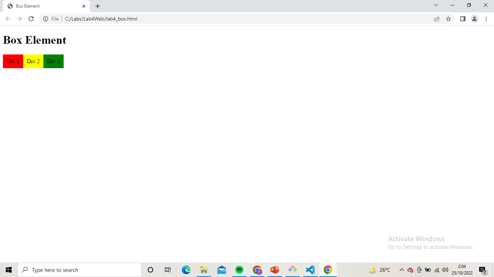

### Mengatur clearfix Element
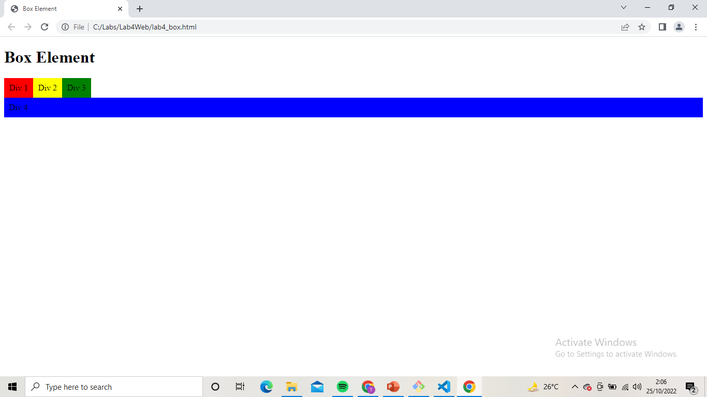

### Mengatur Clearfix Element Right
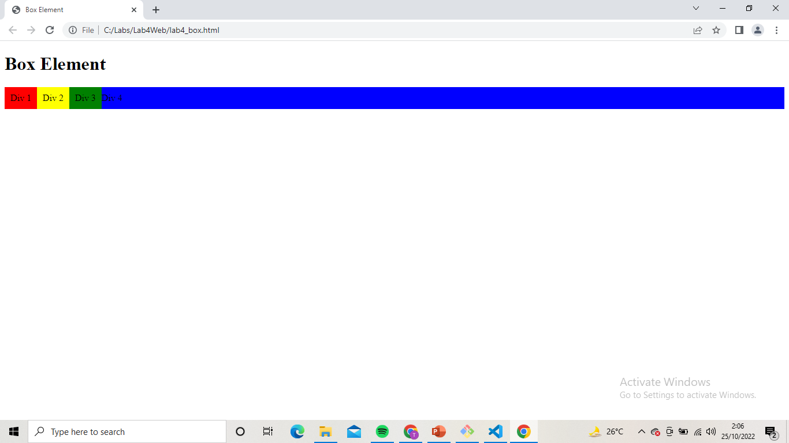

### Membuat Layout Sederhana
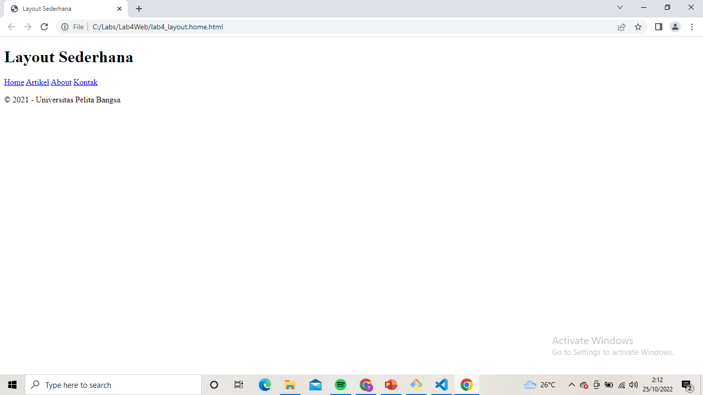

### Membuat Layout
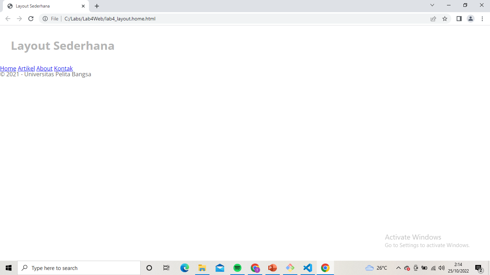

### Membuat Navigasi
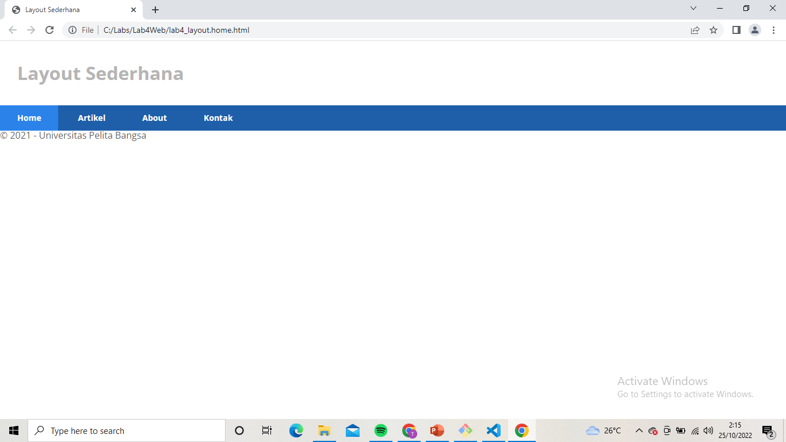

### Membuat Hero Parel
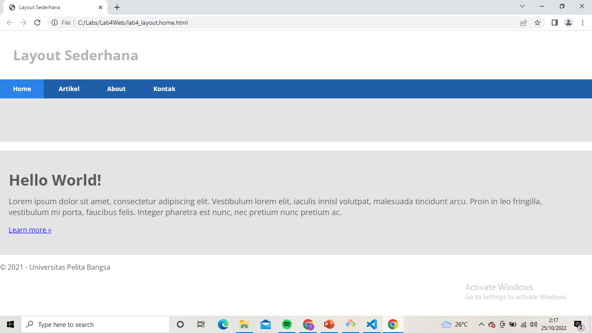

### Mangatur Layout Main dan Sidebar
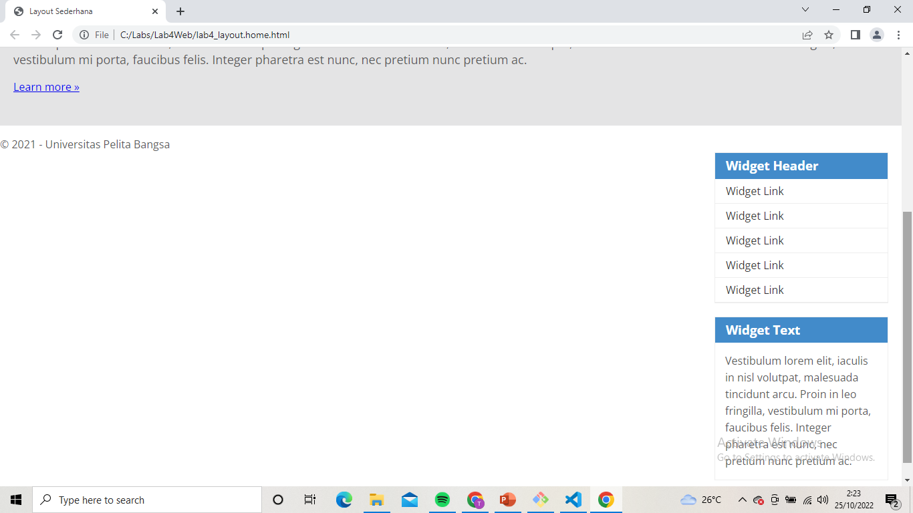

### Mengatur Footer
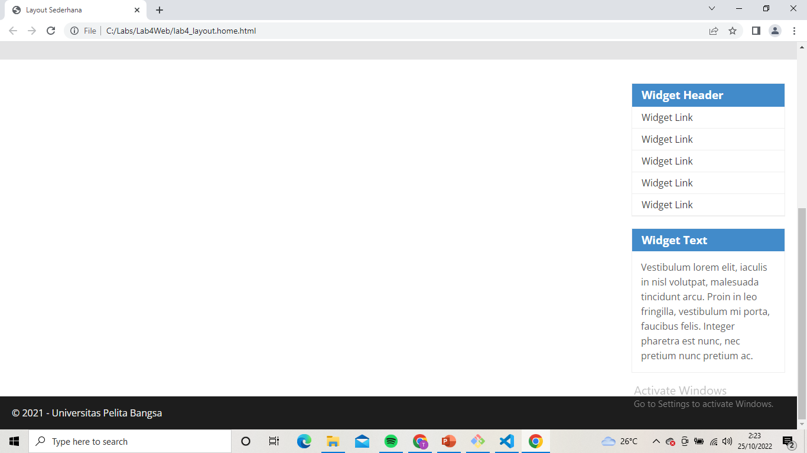

### Menambahkan Element lain pada Main content
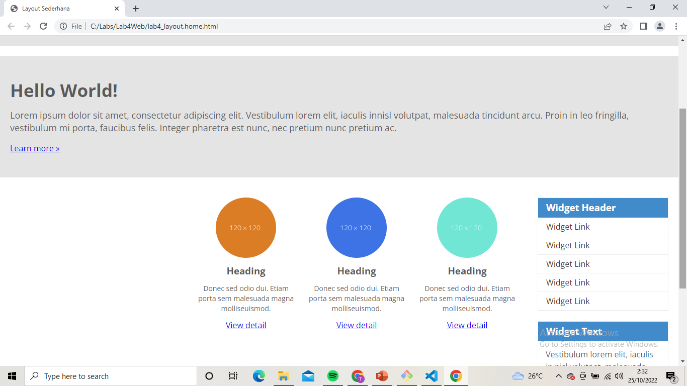

### Menambahkan Konten Artikel
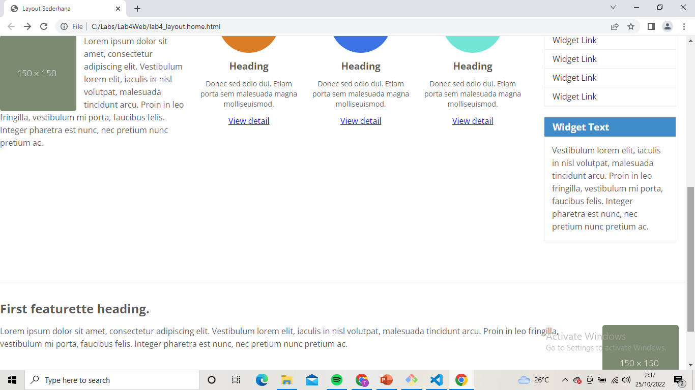

### Tugas menu Layout About
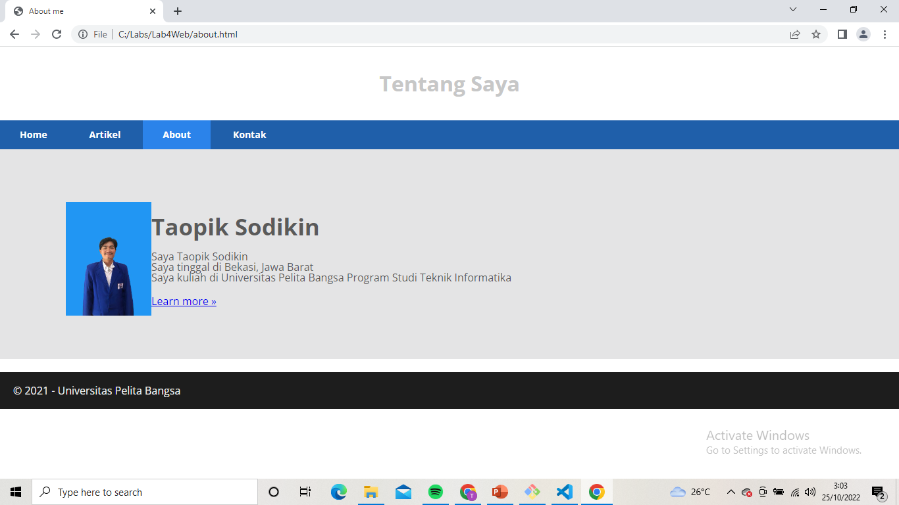

### Tugas menu Layout Kontak
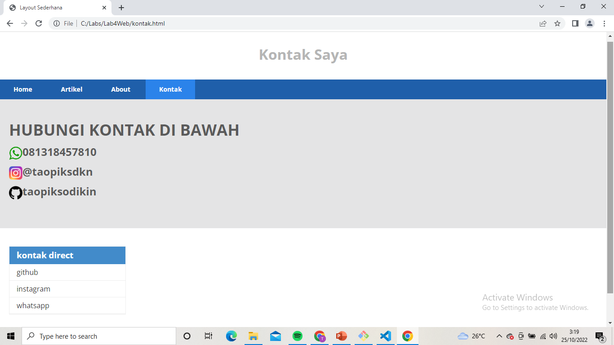
